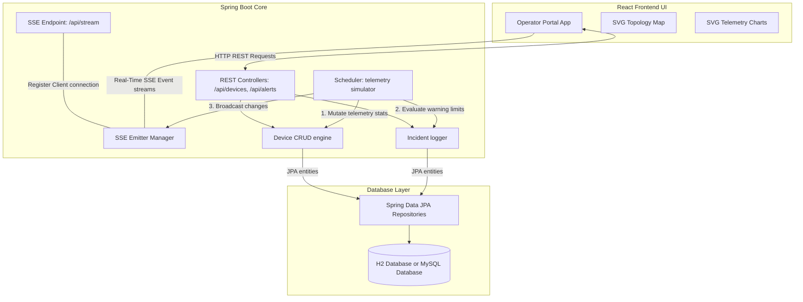
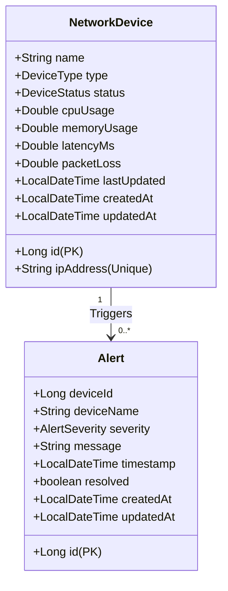

# Network Infrastructure Monitoring System (Net-Guard NOC)

An enterprise-grade, real-time **Network Operations Center (NOC) Monitoring System** designed for administrator operations. This project features a decoupled architecture using a **Java Spring Boot 3.3.1 (Java 21) backend** and a **React (Vite + Vanilla CSS) frontend** running Server-Sent Events (SSE) to push instant metric fluctuations and critical incident tickets directly to client interfaces.

---

## 🏗️ System Architecture

The following Mermaid diagram outlines the decoupled message flow:



---

## 🗄️ Database ER Diagram

The schema model enforces data validation and performance auditing:



---

## ✨ Features

* **Command Center Dashboard**: Aggregates network node status counters (total, online, offline, warnings) and computes a dynamic infrastructure health score.
* **Interactive SVG Topology Map**: Renders network asset relationships (Gateway Router -> Firewall -> Core Switch -> Hosts) dynamically. Connections pulse when active or turn solid red on outages.
* **Live Signal Telemetry Charts**: Real-time sliding metrics window (last 15 entries) rendered using lightweight, performant native SVG spline charts.
* **Automated Incident Logging**: Scans telemetry data on the backend (every 3 seconds), raising WARNING tickets (CPU > 85%, Latency > 150ms) or CRITICAL alerts (Offline) and broadcasting them with synthesized operator audio buzzers.
* **Dynamic Table Pagination**: Limits device view tables to 5 entries per page with range indexes and page sliders.
* **Report Auditing & Exports**: Date filters combined with custom text report compiles (Export PDF) and CSV spreadsheets (Export Excel) generated dynamically in-browser.
* **Database Independent Design**: Utilizes Spring Data JPA repositories with standard SQL mappings, enabling a simple transition from H2 to MySQL with configuration profile swapping.

---

## 🛠️ Technology Stack

* **Backend**: Java 21, Spring Boot 3.3.1 (Spring MVC, Spring Data JPA, Jakarta Validation)
* **Database**: H2 In-Memory Database (Default) / MySQL 8.x (Production Ready)
* **Frontend**: React 18, Vite 5, Lucide React (Icons)
* **Styling**: Modern Custom CSS variables, Glassmorphism panels, Neon indicators.
* **Communication Protocol**: REST APIs (HTTP JSON) and Server-Sent Events (SSE).

---

## 📂 Folder Structure

```text
network-infrastructure-monitoring/
│
├── backend/                              # Spring Boot Maven Project
│   ├── src/main/java/com/netmon/backend/
│   │   ├── config/                       # Database seeder
│   │   ├── controller/                   # REST API & SSE mappings
│   │   ├── dto/                          # Serialization models
│   │   ├── exception/                    # Global exception handlers
│   │   ├── mapper/                       # Entity-DTO mapping components
│   │   ├── model/                        # JPA Entities and Enums
│   │   ├── repository/                   # JPA Repository interfaces
│   │   └── service/                      # Core business services & Schedulers
│   ├── src/main/resources/
│   │   └── application.properties        # Server port, DB dialects, H2 configurations
│   └── pom.xml                           # Maven dependencies
│
├── frontend/                             # Vite + React Client
│   ├── src/
│   │   ├── components/                   # Sidebar, TopBar, SVG charts, Topology
│   │   ├── hooks/                        # useSse connection hook
│   │   ├── pages/                        # Login, Dashboard, Devices, Alerts, Reports, Settings
│   │   ├── services/                     # REST fetch endpoints
│   │   ├── App.jsx                       # State coordinator & Web Audio synth
│   │   ├── index.css                     # Design tokens & CSS styles
│   │   └── main.jsx                      # React entrypoint
│   ├── index.html                        # Google font linking
│   ├── vite.config.js                    # Vite server configurations
│   └── package.json                      # React & Lucide dependencies
│
└── README.md                             # Project Documentation
```

---

## ⚙️ Installation & Running

### Prerequisites
* **Java Development Kit (JDK) 21** or later
* **Node.js** (v18.x or later) and **npm** (v10.x or later)

---

### Step 1: Run the Spring Boot Backend

1. Navigate to the backend folder:
   ```bash
   cd backend
   ```
2. Build the project using the Maven Wrapper:
   * **Windows (PowerShell)**:
     ```powershell
     ./mvnw.cmd clean compile
     ```
   * **Linux/macOS**:
     ```bash
     chmod +x mvnw
     ./mvnw clean compile
     ```
3. Boot the server:
   * **Windows (PowerShell)**:
     ```powershell
     ./mvnw.cmd spring-boot:run
     ```
   * **Linux/macOS**:
     ```bash
     ./mvnw spring-boot:run
     ```
4. The server starts at `http://localhost:8080`.
5. H2 Database console is available at `http://localhost:8080/h2-console` (JDBC URL: `jdbc:h2:mem:netmondb`, Username: `sa`, Password: empty).

---

### Step 2: Run the React Frontend

1. Open a new terminal and navigate to the frontend folder:
   ```bash
   cd frontend
   ```
2. Install npm package dependencies:
   ```bash
   npm install
   ```
3. Launch the Vite development server:
   ```bash
   npm run dev
   ```
4. Open your browser and navigate to the local portal:
   `http://localhost:5173`

---

## 🔐 Credentials & Authentication

The gate auth panel simulates access verification. The default operator credentials are:
* **Username**: `admin`
* **Encrypted Key (Passcode)**: `admin123`

---

## 📡 API Endpoints Documentation

### Devices Endpoints (`/api/devices`)
* **GET `/api/devices`**: Fetches all monitored nodes.
* **GET `/api/devices/{id}`**: Fetches a single device.
* **POST `/api/devices`**: Registers a new device. Validates IP pattern.
* **PUT `/api/devices/{id}`**: Updates device Name, IP, or Type.
* **DELETE `/api/devices/{id}`**: Deregisters device and removes connections.

### Alerts Endpoints (`/api/alerts`)
* **GET `/api/alerts`**: Full history of alerts (descending order).
* **GET `/api/alerts/unresolved`**: Active unresolved anomalies.
* **POST `/api/alerts/{id}/resolve`**: Acknowledges and resolves alert.

### Stream Endpoints (`/api/stream`)
* **GET `/api/stream`**: Establishes persistent EventSource pipeline (`text/event-stream`).

---

## 🛢️ Production MySQL Switching

To transition the backend storage from the default H2 database to MySQL:
1. Add the MySQL connector dependency in `backend/pom.xml`:
   ```xml
   <dependency>
       <groupId>com.mysql</groupId>
       <artifactId>mysql-connector-j</artifactId>
       <scope>runtime</scope>
   </dependency>
   ```
2. Open `backend/src/main/resources/application.properties`.
3. Comment out the H2 Database configuration lines.
4. Uncomment the MySQL configuration block and insert your database endpoint, user credentials, and password:
   ```properties
   spring.datasource.url=jdbc:mysql://localhost:3306/netmon_db?createDatabaseIfNotExist=true&useSSL=false&serverTimezone=UTC
   spring.datasource.username=your_root_user
   spring.datasource.password=your_secure_password
   spring.datasource.driverClassName=com.mysql.cj.jdbc.Driver
   spring.jpa.database-platform=org.hibernate.dialect.MySQLDialect
   ```
5. Restart the Spring Boot application. Hibernate will auto-generate the table schemas (`network_devices` and `alerts`) on start.
